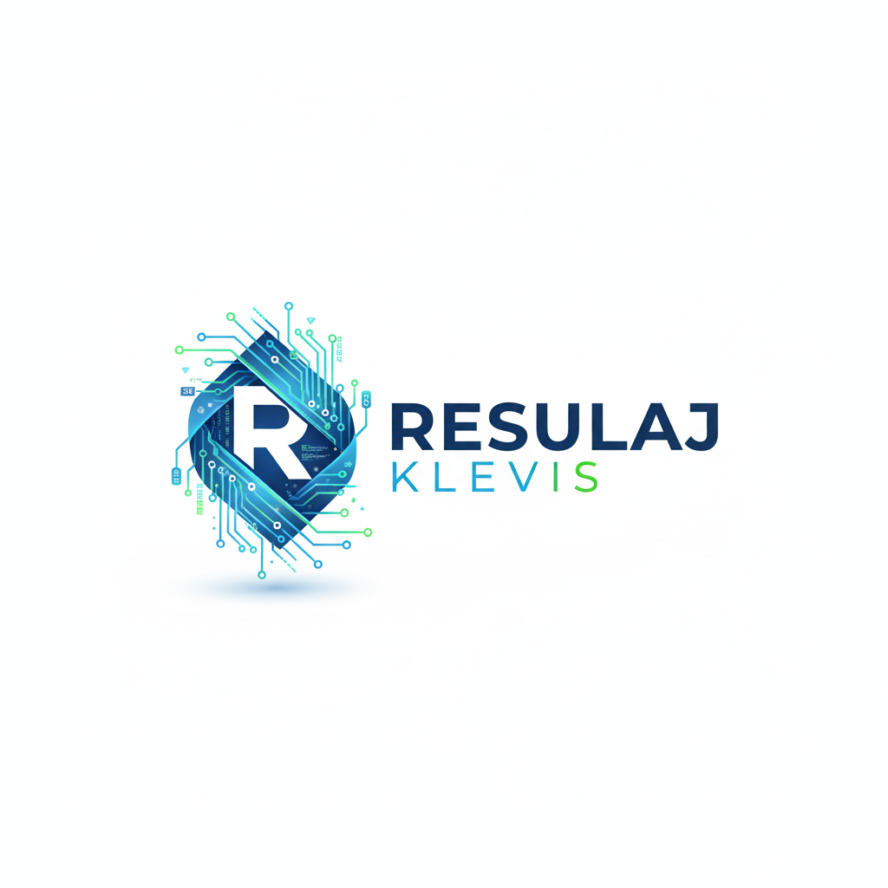

  

---
# Hi there, I'm Klevis Resulaj! 👋 Welcome to my corner of the web.

I'm a passionate tech enthusiast, a perpetual tinkerer, and a web developer who finds joy in building things from the ground up. My curiosity doesn't stop at the code editor; it extends to the bare metal in my homelab, where I experiment with infrastructure and self-hosting. I'm driven by the challenge of solving problems and the thrill of seeing an idea come to life.

---

## 🚀 What I'm Up To

* 💻 **Building Web Apps:** I spend most of my time architecting and creating full-stack web applications. I love the entire process, from designing a responsive front-end to building a robust back-end.

* 🏠 **Running My Homelab:** My personal server rack is my playground! I'm constantly experimenting with self-hosting open-source services, setting up virtual machines, and learning the ins and outs of networking and system administration. It's the perfect environment to test new technologies in a real-world setting.

* 🔧 **Tinkering with Tech:** Whether it's a new piece of hardware, a promising open-source project, or a complex configuration, I love to dive in, take it apart (figuratively and sometimes literally!), and understand how it works.

* 🌱 **Always Learning:** The tech world moves fast, and I'm running right along with it! I'm on a continuous journey to expand my skill set and deepen my understanding of modern development practices.

---

## 🛠️ My Tech Toolbox & Learning Path

Here's a snapshot of the technologies I'm currently working with and mastering:

* **Languages:**
    *  `Python`: For scripting, automation, and back-end logic.
    *  `JavaScript`: The language of the web, powering my dynamic applications.
    *  `TypeScript`: For building scalable, type-safe applications.
    *  `Java`: Exploring its powerful capabilities for enterprise-level applications.

* **Front-End & Back-End:**
    *  `Node.js`: My go-to for building fast and scalable server-side applications.
    *  `React`: For crafting beautiful, interactive, and modern user interfaces.

* **Databases:**
    *  `MongoDB`: For flexible, NoSQL data storage.
    *  `MariaDB`: For robust, relational database management.

* **DevOps & Infrastructure:**
    *  `Docker`: I containerize everything! It's essential to my workflow for creating consistent and portable development environments.
    *  `Kubernetes (K8s)`: For container orchestration and scalable deployments.
    *  `Ansible`: For configuration management and automation.
    *  `Flux`: For continuous delivery and GitOps with Kubernetes.
    *  `Terraform`: For managing Infrastructure as Code (IaC).

---

## 📫 Let's Connect!

I'm always open to collaborating on interesting projects or just chatting about new tech. Feel free to explore my repositories, and don't hesitate to reach out!

**Let's build something cool together!**
